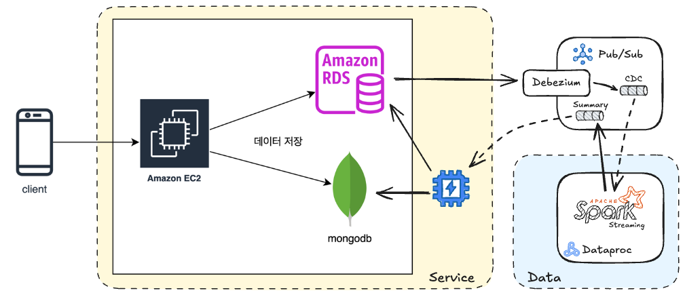

### 문제 이해 및 가정
- "실 서비스에 영향이 없어야 한다"라는 조건은 운영 데이터베이스(RDB, MongoDB)에서 직접 데이터를 읽는 것을 피해야 한다는 의미로 해석했습니다.
- RDB나 MongoDB의 데이터 저장 서버 구성은 현재 상태를 유지하는 것으로 해석했습니다.
- AWS 혹은 GCP 클라우드 환경을 고려해야 한다는 조건은 클라우드 서비스를 최대한 활용해야 한다는 의미로 해석했습니다.
- 30분 전까지의 집계 데이터를 확인하는 주요 사용자는 상점 업주일 것으로 가정하였으며, 이에 따라 데이터 요청이 빈번할 것으로 예상하였습니다.

### Thinking Process
- 운영 데이터베이스의 직접 조회를 피하기 위해 log-based CDC(Change Data Capture)를 활용하여 결제 데이터의 변경사항을 실시간으로 추적합니다.
- CDC는 데이터베이스 리소스를 일부 사용하지만, 서비스 운영에 미치는 영향이 미미하므로 요구사항을 충족할 수 있습니다.
- 클라우드 서비스를 최대한 활용해야 한다는 요구사항에 따라, CDC 데이터는 Pub/Sub으로 메세지를 생산하도록 하겠습니다.
- 집계 데이터를 보여줘야 하는 대상이 상점 업주라면 서비스에서 집계된 데이터에 쉽게 접근할 수 있어야 합니다. 따라서 최종적인 데이터는 RDB와 같은 OLTP 데이터베이스에 적재하는 것이 효율적입니다.
- 집계 데이터의 종류가 결제 금액 합산, 상품 수 처럼 단순한 경우 다음과 같이 스키마를 정리할 수 있습니다.
    
    | date | store_id | total_profit | total_qty |
    | --- | --- | --- | --- |
    | 2025-03-07 | store-a | 5,420,000 | 78 |
    | 2025-03-08 | store-a | 6,287,300 | 94 |
- 원본 결제 데이터의 CDC 데이터를 "집계 데이터의 증감값"으로 변환하는 작업이 필요하며, 이는 Spark Streaming을 통해 구현할 예정입니다.
- "집계 데이터의 증감값"을 다시 Pub/Sub으로 메시지를 발행하도록 하겠습니다.
- 서버 애플리케이션이 RDB를 직접 관리하는 경우, 해당 애플리케이션이 Pub/Sub으로부터 집계 데이터의 증감값을 받아서 적용합니다. 그렇지 않은 경우에는 별도의 서비스를 구성하여 데이터를 RDB에 반영합니다.

### 요약

운영 데이터베이스(RDB, MongoDB)에서 결제 데이터를 직접 읽는 것을 피하기 위해 log-based CDC solution(Debezium)을 활용하여 Pub/Sub으로 데이터를 전송하고, 이를 활용할 수 있도록 구성하였습니다.

CDC 데이터를 "집계 데이터의 증감값"으로 실시간 변환하기 위해 Spark Streaming과 같은 스트리밍 변환 기술을 활용합니다. 이때 데이터 중복 처리를 방지하기 위해 Tumbling Window 전략을 적용합니다. 변환된 증감값 데이터는 다시 Pub/Sub으로 전송되는데, 이는 서비스와 데이터 처리의 역할을 명확히 분리하기 위해 Spark에서 운영 데이터베이스에 직접 쓰지 않는 방식을 선택했기 때문입니다. 

집계 데이터는 사용자의 특성에 따라 적재 위치를 다르게 설정해야 합니다. 현재 상점 업주들이 서비스를 통해 집계 데이터를 열람하는 상황을 가정했기 때문에, OLTP 데이터베이스에 적재하는 것이 적절하다고 판단했습니다. 또한 운영 데이터베이스가 서비스 영역에 속하므로, 서비스에서 직접 운영 데이터베이스에 적재하는 방식을 선택했습니다.

RDB로 데이터를 쓰는 과정에서 데이터베이스 리소스가 사용되지만 이는 서비스의 일부이므로 “실 서비스에 영향이 없어야 한다”는 조건에 위배되지 않는다고 판단했습니다. 만약 리소스 사용이 문제가 된다면 별도의 운영 데이터베이스를 구성할 수 있지만 이는 기존 운영 데이터베이스 리소스의 스케일 아웃과 동일한 결과이기 때문에 이와같은 아키텍처를 구성하였습니다.